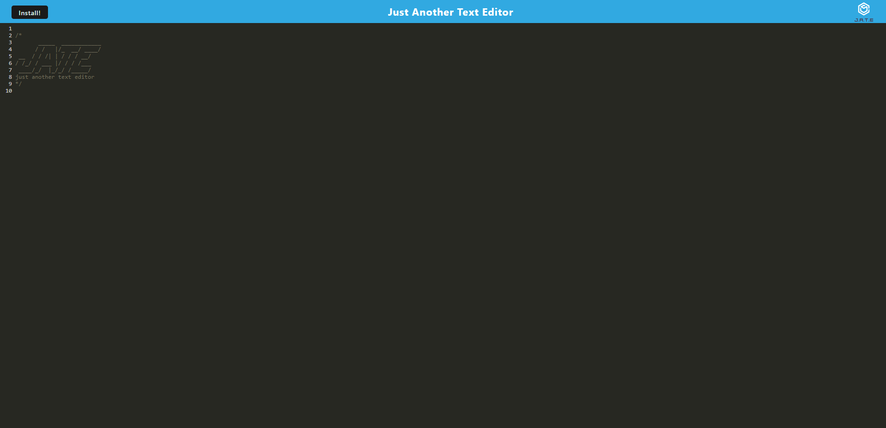

# Text Editor

[](https://opensource.org/licenses/MIT)

[checkout the site!](https://infinite-tor-98163.herokuapp.com/)



## Description
This application is a Text Editor that runs in the browser which uses the IndexedDB API. I built this application to learn to build progressive web applications.

## Technology Used
* IndexedDB
* express
* if-env
* PWA
* Node.js
* Webpack

## Code Snippet
Here I have logic that provides a way to accept content and add it to the database

```JavaScript
export const putDb = async (content) => {
  const jate = await openDB("jate", 1);
  const tx = jate.transaction("jate", "readwrite");
  const store = tx.objectStore("jate");
  const request = store.put({ id: 1, content: content });
  const result = await request;
  return result;
};
```
Similiarly here I wrote logic to get all the content from the database
```JavaScript
export const getDb = async () => {
   const jate = await openDB('jate', 1);
   const tx = jate.transaction('jate', 'readonly')
   const store = tx.objectStore('jate');
   const request = store.getAll();
   const result = await (request);
   return result.value;
};
```

## Author links
* [GitHub](https://github.com/mattjgatsby)
* [LinkedIn](https://www.linkedin.com/in/matthew-gatsby-1a1521250/)